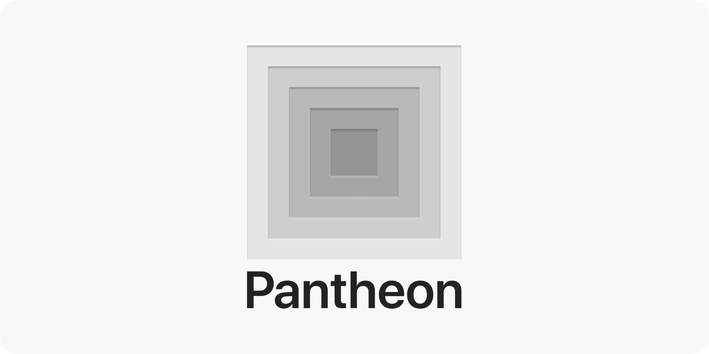

# Pantheon

Pantheon is an open-source WYSIWYG web application editor with real-time interaction and code generation.

The main goal is to destroy the barrier between design and development by eliminating the time and effort to convert the design to code.

[Radix Themes](https://www.radix-ui.com/) is the primary component library for the editor as you can see in the name. But any other component library or even custom components including the native DOM elements can be used.

Try the demo at [radix-ui.studio](https://radix-ui.studio/) and see how it works. You can't save or load your work yet.

> **Note**: It is still in development and not ready for production.

## Dev

```sh
bun install
bun run dev
```

## Roadmap

- [x] Declare drawer item with node then clone node when drag and drop to easel
- [ ] Re-write UI guides in Vanilla
- [ ] Routing
  - [ ] Connect to other pages
- [x] Focus on the page on creation
- [x] Handle ground overscroll
  - Double click page to focus
- [x] Keyboard shortcuts
- [x] Improve design mode
- [x] Multiple pages
  - [x] Render multiple pages inside a single ground
- [x] Click drawer item to add node to easel
- [ ] Stop unnecessary css animations of components
- [x] Tree view
- [ ] Lock/unlock nodes
- [x] Improve text-based nodes controlling experience
  - Introduce mass mode
- [x] Seamless panning from inside iframe to outside iframe
- [ ] View (Template)
  - [ ] Labeling
  - [ ] Detached
  - [ ] Synced
- [ ] Conditional rendering
- [ ] Repetitive rendering
- [x] Subscription-based global node atoms list update instead of registering/deleting logic inside each function
- [x] Use iframe for easel
  - [x] Sync drag and drop
    - [x] Sync events
      - [x] Sync mouse events
      - [x] Sync keyboard events
  - [x] Sync atoms
- [x] Drag and drop nodes
  - [x] From drawer to easel
    - [x] Add to container
    - [x] Add to index of container
  - [x] Generalize implementation -> easel and easel -> easel (currently duplicate implementation)
  - [x] Move inside easel
    - [x] Move to another container
      - [x] Prevent moving outer container to inner container (tree violation)
        - [x] Improve logic. Check contains -> Just ignore pointer events on the dragging elements
    - [x] Move to another index of container
- [x] Multi selection, dragging, editing
  - [x] Multi selection
  - [x] Drag and drop multiple nodes
    - [ ] Improve ghost
  - [x] Delete multiple nodes
  - [x] Multiple node editing
- [x] Context menu
- [x] Copy and paste nodes
  - [x] Copy nodes
  - [x] Paste nodes
  - [x] Paste nodes to another container
  - [x] Paste nodes to another index of container
- [ ] Generate tsx code
  - [ ] Download file
    - [x] Download single file
    - [ ] zip multiple files
  - [x] Props
  - [x] Self closing tag when there is no children
  - [x] Generate part of code
- [x] Type meta data
  - [x] Record components version
- [x] Separate node properties to props key
- [ ] ~~Use `map` or `deepMap` for node atoms~~
- [ ] ~~Declarative application generation~~
  - [ ] ~~Generate Studio code itself from component language server~~
  - [ ] ~~Generate type guard functions~~
- [x] Solution for handling components version up
  - Introduce Library
- [x] Improve rendering performance on bulk node update
  - For example, when inserting multiple nodes, it should not re-render the easel for each node insertion.
  - This is not a problem for now. But it will be a problem when we have a lot of nodes.
- [x] Flexible easel positioning
  - [x] Zoom in/out
  - [x] Pan
- [x] Undo/Redo
  - [x] Action-based instead of state-based
  - [x] Bundle multiple actions into a single action bundle
  - [x] Insert
  - [x] Remove
  - [x] Move nodes (Insert)
  - [x] Properties
  - [ ] ~~Slots~~
  - [x] Wrap (Insert)
  - [x] Unwrap (Insert + Remove)
  - [x] Resize pages
  - [x] Move pages (translate)
- [x] Composition components are not containable nodes
- [x] Don't add custom style or class to components. Instead use `data-*` attributes for custom styling.
- [ ] ~~Pass shared data from top window to iframe through postMessage instead of window injecting.~~
- [x] Wrap common node props to a single object. (instead of rest props)
- [ ] ~~Inject node attributes to the outermost element of components.~~
- [ ] State management

## License

Pantheon is licensed under the [MIT License](LICENSE).
